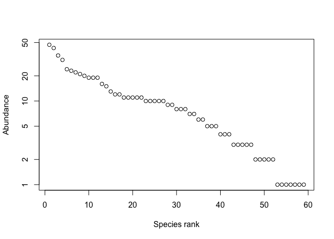
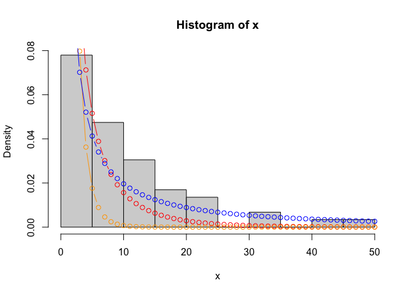
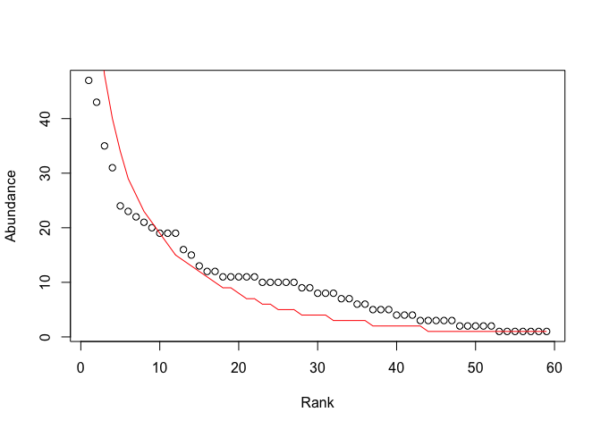
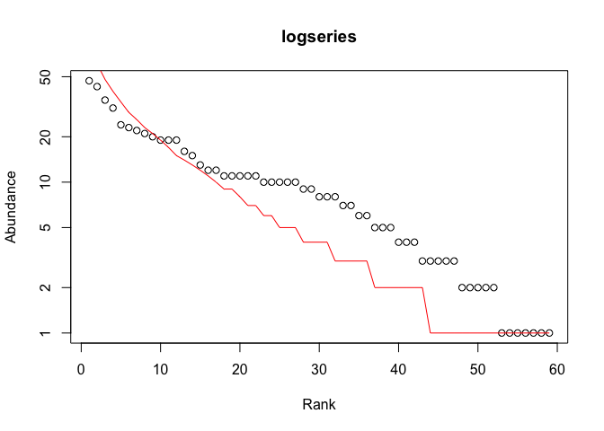
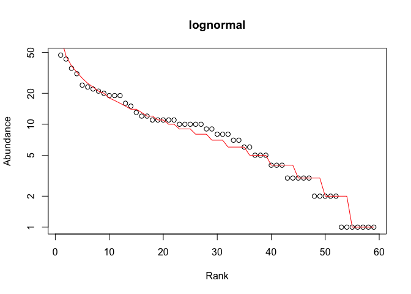
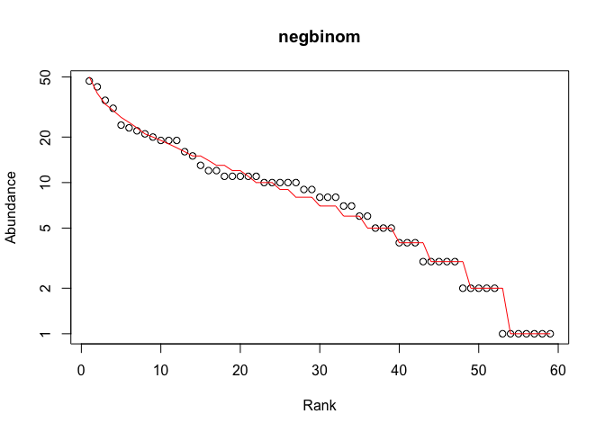
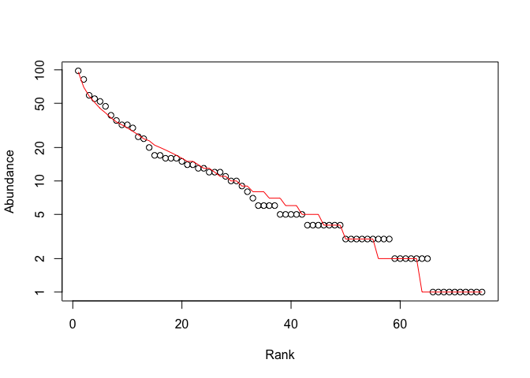

Notes on likelihood
================

Here we document how to work with likelihoods.

First let’s read in the data we generated from the multi-species
competitive model.

``` r
x <- readRDS('lvMultiSim.Rds')
plot(sort(x, decreasing = TRUE), log = 'y', 
     xlab = 'Species rank', ylab = 'Abundance')
```

<!-- -->

We’re going to fit the log-series distribution to the data. Here we make
a *function* to compute the log-series.

``` r
lseries <- function(b, n) {
    1 / log(1 / (1 - exp(-b))) * exp(-b * n) / n
}

hist(x, probability = TRUE)

points(1:50, lseries(0.1, 1:50), col = 'red', type = 'b')
points(1:50, lseries(0.5, 1:50), col = 'orange', type = 'b')
points(1:50, lseries(0.01, 1:50), col = 'blue', type = 'b')
```

<!-- -->

A likelihood is simply the probability of observing the data. Because
these probabilities are typically very small, we most often work in log
transformed probability, or *log likelihood*.

``` r
sum(log(lseries(0.001, x)))
```

    ## [1] -226.1041

``` r
sum(log(lseries(0.01, x)))
```

    ## [1] -207.8483

``` r
sum(log(lseries(0.5, x)))
```

    ## [1] -418.8434

    ## quartz_off_screen 
    ##                 2

Fitting the model to the data precisely means finding the parameter
value that maximizes the likelihood function.

``` r
llLSeries <- function(b, n) {
    sum(log(lseries(b, n)))
}


optimize(llLSeries, interval = c(0, 10), n = x, maximum = TRUE)
```

    ## $maximum
    ## [1] 0.02533946
    ## 
    ## $objective
    ## [1] -204.2378

We can did all that likelihood by hand, but we can also use the pika
package

``` r
# devtools::install_github('ajrominger/pika')

library(pika)
s <- sad(x, 'lseries')
s
```

    ## species abundance distribution modeled by "lseries" with parameter 
    ## [1] 0.02535964
    ## includes data

``` r
logLik(s)
```

    ## 'log Lik.' -204.2378 (df=1)

The pika package let’s us do nicer plots, and calculate a z-statistic,
which is a goodness of fit measure.

``` r
plot(s, ptype = 'rad')
```

<!-- -->

``` r
logLikZ(s)
```

    ## [1] 3.331813

``` r
pchisq(3.33, df = 1, lower.tail = FALSE)
```

    ## [1] 0.06802687

Model comparison necessitates that we penalize models for their
complexity (i.e. number of parameters). We do this with AIC

``` r
ls <- sad(x, 'lseries')
ln <- sad(x, 'plnorm')
nb <- sad(x, 'tnegb')

AIC(ls)
```

    ## [1] 410.4756

``` r
AIC(ln)
```

    ## [1] 397.503

``` r
AIC(nb)
```

    ## [1] 394.2482

``` r
plot(ls, ptype = 'rad', log = 'y', main = 'logseries')
```

<!-- -->

``` r
plot(ln, ptype = 'rad', log = 'y', main = 'lognormal')
```

    ## Warning in regularize.values(x, y, ties, missing(ties), na.rm = na.rm):
    ## collapsing to unique 'x' values

<!-- -->

``` r
plot(nb, ptype = 'rad', log = 'y', main = 'negbinom')
```

<!-- -->

``` r
logLikZ(ls)
```

    ## [1] 3.331813

``` r
logLikZ(nb)
```

    ## [1] 2.101964e-08

Let’s see if output from a neutral model looks any different

``` r
library(roleR)

p <- untbParams(1000, 100000, 200, 0.01, 0.1, 'oceanic_island', 
                50000, 50000)
y <- roleModel(p)
y <- iterModel(y)
y <- getFinalState(y)
y <- getSumStats(y, list(abund = rawAbundance))
y <- y$abund$abund
y <- y[y > 0]

untbNB <- sad(y, 'tnegb')
plot(untbNB, ptype = 'rad', log = 'y')
```

<!-- -->

``` r
logLikZ(untbNB)
```

    ## [1] 0.007566351
